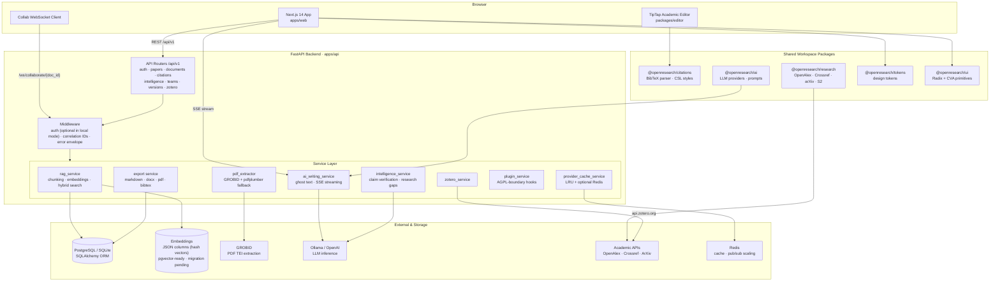
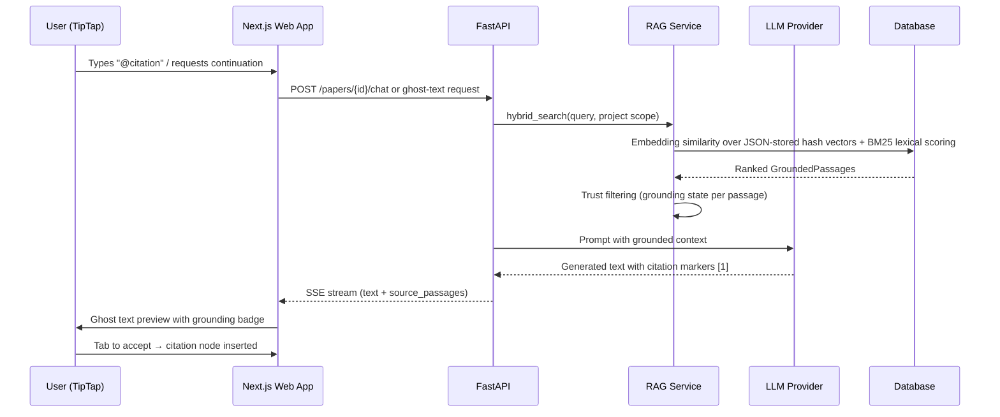

# OpenResearch — System Architecture

> **Stack:** Next.js 14 (App Router) · FastAPI · SQLAlchemy · PostgreSQL (SQLite in dev) · TipTap Editor · npm Workspaces monorepo

## System Overview



## Data Flow: Grounded Writing Pipeline



## Key Architectural Decisions

| Concern | Decision |
|---|---|
| **Polymorphic ownership** | All resources hang off an `Owner` (user or team) via `Membership` rows with role-based access (`owner`/`editor`/`viewer`) |
| **Grounding contract** | Every AI-generated segment carries a `GroundingState`; unverified extractions receive retrieval penalties |
| **Citation integrity** | Citations are first-class `Citation` nodes linking documents ↔ papers with attribution scope (sentence/clause) and page numbers |
| **Chunking** | Papers are segmented into abstract/section/table/equation chunks with sliding-window overlap on long paragraphs; each chunk stores a normalized embedding (currently a JSON column with a hash-based vector — pgvector-ready schema, migration pending) for hybrid retrieval |
| **Local-first auth** | Authentication endpoints exist, but the product runs in single-user local mode where requests resolve to a local workspace user; JWT bearer tokens remain supported for API clients (e.g., the browser extension) but are not required locally |
| **Provider abstraction** | External dependencies (LLMs, academic APIs) sit behind provider interfaces so local models (Ollama) work offline |
| **Plugin boundary** | Plugins execute through typed hooks (`on_paper_extract`, `on_citation_format`, `on_export`) inside the AGPL-3.0 compliance boundary |

## Repository Layout

```text
├── apps/
│   ├── web/                 # Next.js 14 frontend (App Router, Tailwind, Radix)
│   └── api/                 # FastAPI backend (services, models, Alembic migrations)
├── packages/
│   ├── editor/              # TipTap extensions (citations, math, ghost text, trust markers)
│   ├── citations/           # BibTeX parsing + CSL style formatting
│   ├── ai/                  # LLM provider abstraction (OpenAI, Ollama, custom)
│   ├── research/            # Academic metadata providers
│   ├── ui/                  # Shared Radix/CVA component primitives
│   ├── tokens/              # Design tokens (WCAG AA verified)
│   └── plugins/             # Plugin lifecycle types
├── infrastructure/          # Dockerfiles, docker-compose (self-host)
├── docs/                    # product spec, audits, policies, this architecture doc
└── .github/workflows/ci.yml # lint → typecheck → test → build pipeline
```
